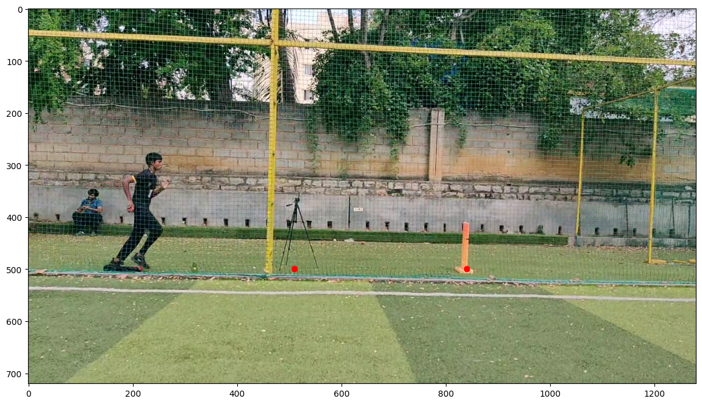
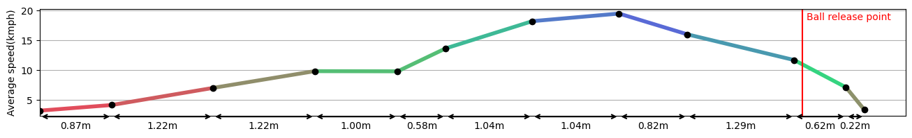
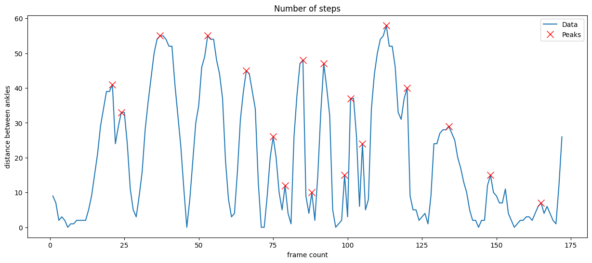

# 🏏 Bowling Run Speed Analysis using YOLOv8 and MediaPipe

This project analyzes a cricket bowler’s run-up by applying computer vision techniques to track motion and compute the **speed profile** over time. It uses **YOLOv8** for detecting the bowler and **MediaPipe Pose** for extracting pose landmarks. Real-world scaling is done using fixed reference objects (like tripod and stump), enabling accurate speed estimation.

---

## 📌 Key Features

- 🎯 Detects bowler using YOLOv8 object detection
- 🧍‍♂️ Extracts body landmarks using MediaPipe Pose
- 📏 Calibrates pixel distance to real-world units using tripod and stump
- 📈 Computes frame-by-frame displacement and instantaneous speed
- 📊 Generates a smooth **speed vs time profile** of the bowler
- 📉 Visualizes motion trajectories and speed plots

---

## 🛠️ Technologies Used

- Python
- OpenCV
- MediaPipe
- Ultralytics YOLOv8
- NumPy, SciPy, Matplotlib, Pandas

---

## 📊 Sample Output

### 🎥 Bowler’s Run-up Snapshot

This frame is extracted from the input video and used as the base reference for all processing — including detection and pose tracking.

---

### 📈 Speed Profile of the Bowler

The following graph plots the estimated **speed vs distance**  during the bowler’s run-up. This is calculated using the displacement of the detected bowler across frames, scaled to real-world units using fixed markers (tripod and stump).

---

### 🦶 Step Count Detection

This plot highlights the local maxima in the speed signal to estimate the **number of steps** the bowler takes during the run-up. Peaks in motion profile correspond to foot impact points.

